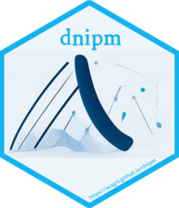

<!-- README.md is generated from README.Rmd. Please edit that file -->

# dnipm <a href="https://ausgis.github.io/dnipm/"></a>

<!-- badges: start -->
<!-- badges: end -->

**Two-Dimensional Numerical Interpolation Methods**

## Installation

You can install the development version of dnipm from
[GitHub](https://github.com/) with:

``` r
# install.packages("pak")
pak::pak("ausgis/dnipm")
```
